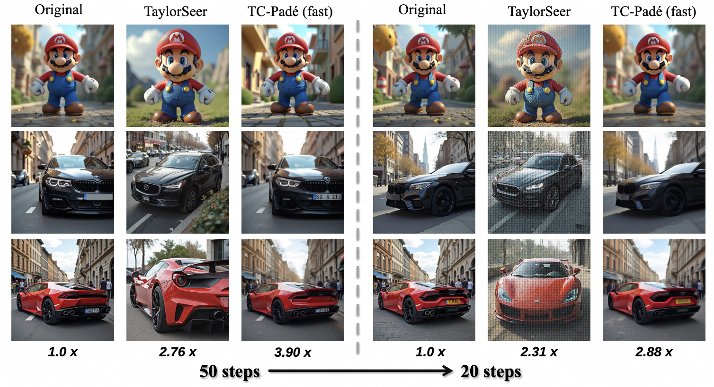

# TC-Pad&eacute;: Trajectory-Consistent Pad&eacute; Approximation for Diffusion Acceleration

**Official implementation of TC-Pad&eacute; (CVPR 2026)** 🎉

<p align="center">

<a href="https://arxiv.org/abs/2603.02943">


</p>


<p align="center">
  
</p>


To address the computational inefficiency of diffusion models and the limitations of existing polynomial-based feature caching methods that suffer from error accumulation in practical low-step regimes, this paper proposes Trajectory-Consistent Padé approximation (TC-Padé). By modeling feature evolution through rational functions rather than Taylor series, TC-Padé captures complex asymptotic behaviors more accurately and incorporates adaptive coefficient modulation alongside step-aware prediction strategies to handle distinct denoising phases.

## 🔧 Installation

```bash
git clone https://github.com/Alibaba-Yufeng/TC_Pade.git
cd TC_Pade
pip install -r requirements.txt
```

**Requirements:** Python >= 3.9, PyTorch >= 2.6, CUDA-capable GPU.

## 🚀 Usage

### Baseline

```bash
python run.py --model_path /path/to/flux.1-dev --num_inference_steps 50
```

### TC-Pad&eacute; Accelerated Inference

```bash
python run.py \
    --model_path /path/to/flux.1-dev \
    --use_predict \
    --num_inference_steps 50 \
    --N 1.4 \
    --interval 8
```

### Argument List

| Argument | Default | Description |
|---|---|---|
| `--model_path` | `path_to_flux.1-dev` | Path to the pretrained FLUX model |
| `--prompts_file` | `./example_prompts.json` | Path to the prompts JSON file |
| `--output_dir` | auto-generated | Output directory for generated images |
| `--num_inference_steps` | `50` | Number of denoising steps |
| `--seed` | `42` | Random seed for reproducibility |
| `--use_predict` | `False` | Enable TC-Pad&eacute; acceleration |
| `--start_step` | `4` | Step to begin prediction |
| `--interval` | `8` | Prediction interval |
| `--N` | `1.4` | Curvature threshold (larger = faster, more aggressive skipping) |
| `--predictor_order` | `3` | Pad&eacute; predictor order |
| `--predictor_history_size` | `6` | Residual history buffer size |

## 📄 Citation

If you find this work useful, please cite:

```bibtex
@article{cui2026tc,
  title={TC-Pad$\backslash$'e: Trajectory-Consistent Pad$\backslash$'e Approximation for Diffusion Acceleration},
  author={Cui, Benlei and He, Shaoxuan and Huang, Bukun and Ye, Zhizeng and Sun, Yunyun and Huang, Longtao and Xue, Hui and Yang, Yang and Tang, Jingqun and Zhao, Zhou and others},
  journal={arXiv preprint arXiv:2603.02943},
  year={2026}
}
```
